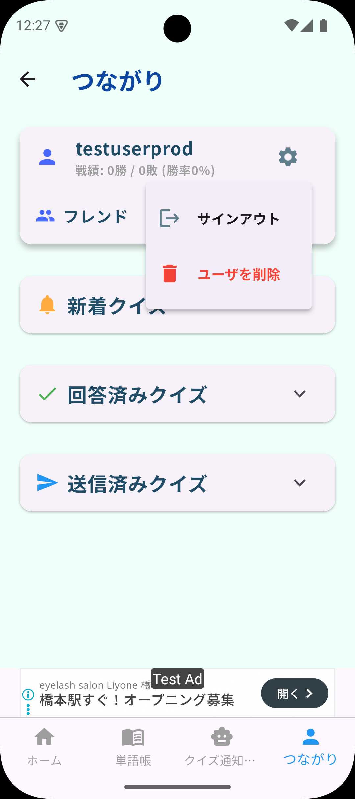
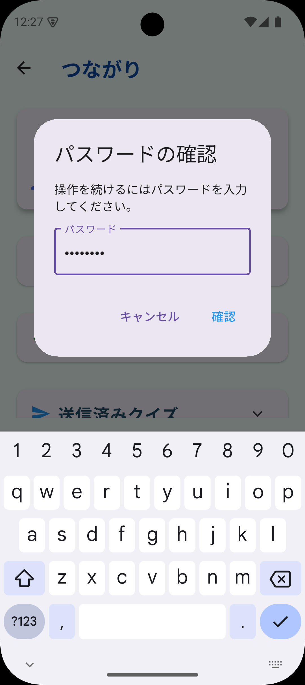

# アカウント削除方法

本ドキュメントでは、アカウントを削除する手順について説明します。

## 削除手順

1. **アプリにログイン**  
   削除したいアカウントでアプリにログインしてください

2. **設定画面を開く**  
   ユーザ名の右横にある歯車アイコン（⚙️）をタップしてください

3. **削除メニューを選択**  
   「ユーザを削除」をタップしてください

4. **本人確認**  
   パスワードの入力が求められますので、現在のパスワードを入力してください

5. **削除の実行**  
   「確認」をタップすると、アカウントの削除が完了します

## 注意事項

- **この操作は取り消せません**。削除したアカウントは復元できませんので、ご注意ください
- アカウントを削除すると、以下のデータが完全に削除されます：
  - ユーザープロフィール情報
  - その他すべての関連データ

## お問い合わせ

アカウント削除に関してご不明な点がございましたら、サポートまでお問い合わせください。